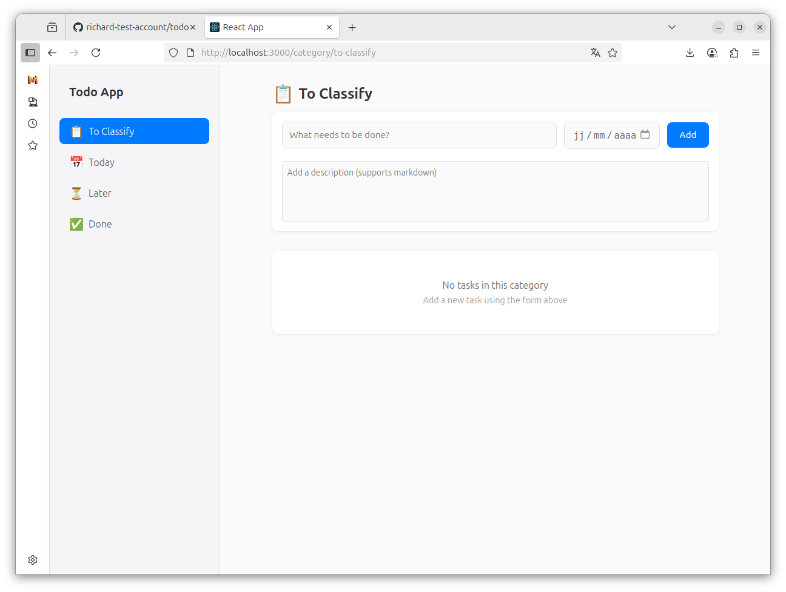

# Simple Todo App



A modern, Things 3-inspired todo application built with React, TypeScript, and IndexedDB.

## Features

- 📋 **Category-based Organization**
  - To Classify: For new tasks that need categorization
  - Today: Tasks due today
  - Later: Upcoming tasks
  - Done: Completed tasks

- ✨ **Task Management**
  - Add tasks with titles and optional descriptions
  - Markdown support in task descriptions
  - Set due dates for tasks
  - Mark tasks as complete
  - Double-click to edit tasks
  - Delete tasks

- 🎨 **Modern UI**
  - Clean, Things 3-inspired design
  - Responsive layout with sidebar navigation
  - Smooth animations and transitions
  - Dark mode support

- 💾 **Data Persistence**
  - IndexedDB for reliable local storage
  - Automatic data synchronization
  - Offline support

## Technologies Used

- React 18
- TypeScript
- React Router for navigation
- IndexedDB for data storage
- React Markdown for description rendering
- CSS Modules for styling

## Getting Started

1. Clone the repository:
   ```bash
   git clone https://github.com/richard-test-account/todo.git
   ```

2. Install dependencies:
   ```bash
   npm install
   ```

3. Start the development server:
   ```bash
   npm start
   ```

4. Open [http://localhost:3000](http://localhost:3000) to view it in the browser.

## Project Structure

```
src/
├── components/
│   ├── CategoryView.tsx    # Category-specific task view
│   ├── Layout.tsx         # Main layout with sidebar
│   └── TodoItem.tsx       # Individual task component
├── types/
│   └── todo.ts           # TypeScript type definitions
├── utils/
│   └── db.ts            # IndexedDB utilities
└── App.tsx              # Main application component
```

## Contributing

1. Fork the repository
2. Create your feature branch (`git checkout -b feature/amazing-feature`)
3. Commit your changes (`git commit -m 'Add some amazing feature'`)
4. Push to the branch (`git push origin feature/amazing-feature`)
5. Open a Pull Request

## License

This project is licensed under the MIT License - see the LICENSE file for details.
